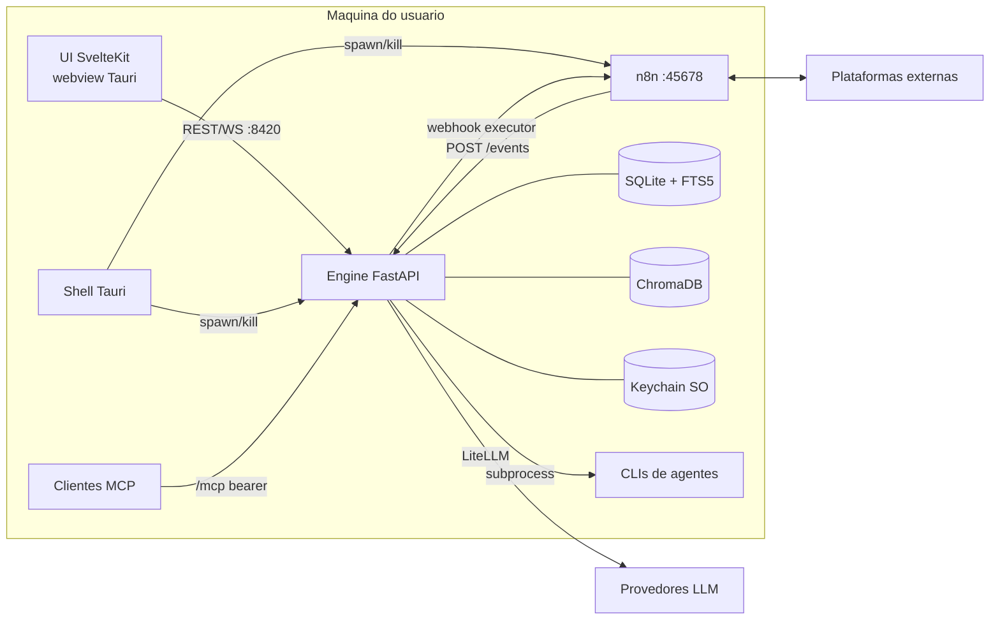
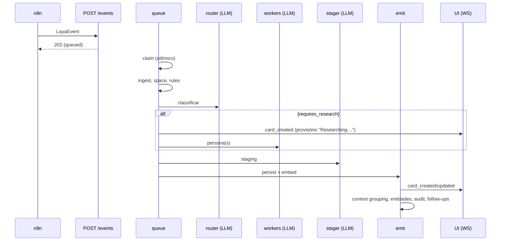

# Laya — Software Design Document (SDD)

| Campo | Valor |
|---|---|
| Versão | 1.0 (baseline, engenharia reversa do código em 2026-09-29) |
| Escopo | Engine Python, UI SvelteKit, shell Tauri, workflows n8n |
| Documentos relacionados | `docs/architecture.md`, `docs/api-contracts.md`, `docs/event-schema.md`, `docs/database-schema.md`, `docs/decision-log.md`, `engine/docs/*.md`, `harness-sdd/specs/`, `docs/guardrails.md`, `docs/design-system/` |

## 1. Propósito e contexto

Laya é um "command center" desktop, local-first e de usuário único. Ele intercepta notificações de ferramentas profissionais, entende o que cada uma pede, prepara a resposta ou ação e apresenta **Action Cards** para o usuário aprovar. O objetivo declarado é que "a resposta esteja pronta antes de abrir a notificação" (SLA alvo de 60 s do evento ao card, decisão #5).

### 1.1 Atores
- **Usuário** (único, dono da máquina): aprova, edita, descarta, configura.
- **Plataformas externas**: Gmail, Outlook, Slack, GitHub, Bitbucket Cloud/Server, Jira, Linear, Notion, Google/Outlook Calendar.
- **Provedores de LLM**: Anthropic, OpenAI, Google, Ollama, LM Studio, endpoints OpenAI-compatíveis (via LiteLLM) e CLIs de agentes instalados.
- **Agentes externos via MCP** (Claude Desktop, IDEs) consumindo ferramentas do Laya.

### 1.2 Objetivos de qualidade
| Atributo | Como é atendido |
|---|---|
| Privacidade | Dados em `~/.laya`, embeddings locais, segredos no keychain, loopback, opção de modelos locais |
| Human-in-the-loop | Toda escrita externa exige preview + confirmação (decisão #28) |
| Resiliência | Fila durável em SQLite com retry/backoff, dead events recuperáveis, recuperação no startup |
| Custo | Router barato + stager forte, gating de prompt, orçamento mensal e por janela |
| Extensibilidade | `Platform` por arquivo, personas por spec, prompts sobrescrevíveis, agentes plugáveis |
| Instalação simples | Instalador único; runtime Python/Node provisionado no primeiro uso |

## 2. Visão de contexto

## 3. Visão de containers

| Container | Tecnologia | Responsabilidade | Processo |
|---|---|---|---|
| Shell | Rust, Tauri v2 | Janela, tray, provisionamento de runtimes, ciclo de vida de engine e n8n, logs rotativos, updater assinado | processo principal |
| UI | SvelteKit SPA, Svelte 5, Tailwind v4, Skeleton v4 | Feed (Pulse), Omni, Coherence, Dashboard, Settings, Workspace, Setup | webview |
| Engine | Python 3.10+, FastAPI, aiosqlite, LiteLLM, ChromaDB | Pipeline, API REST/WS, egress, agentes, MCP, scheduler | `python -m laya.main` em `~/.laya/venv` |
| n8n | Node 20+, n8n 2.15 | Ingestão (polling/triggers) e execução de ações | `~/.laya/n8n_module` |

## 4. Visão de componentes (engine)

| Pacote | Componentes | Notas |
|---|---|---|
| `api/` | ~27 routers + `ws_router`, `websocket.manager` | Cards divididos em `cards_common` + 6 módulos agregados em ordem |
| `pipeline/` | queue, ingest, space_resolution, rules, router, workers, stager, emit, context_grouping, entity_resolution, trace, tags, group_summary, omni, omni_change, chat, executor, learn, context_learn, processing_rules, briefing, summarize, feedback, budget, agent_budget | Async; follow-ups via `laya.tasks.create_task` |
| `workers/` | `persona.py` (`PERSONA_SPECS`), `engineer.py`, `base.py` | 6 personas |
| `llm/` | `client.py` (`llm_call`, `llm_call_streaming`), `agent_backend.py`, `providers.py`, `prompts/`, `tools/` | Prompts por papel, overrides em `~/.laya/prompts` |
| `egress/` | `platforms/*`, `registry`, `router`, `enrichment`, `backends/{n8n,smtp}`, `connections`, `oauth`, `tools`, `tool_handlers`, `health` | Contrato `Platform` |
| `agents/` | adaptadores Claude/Codex/Gemini/Pi/Cursor, `session_manager`, `subprocess_helper`, `mcp_config`, `staging_cleanup` | `BaseCodingAgent` |
| `integrations/` | `n8n_bootstrap`, `n8n_client`, `platforms` | Sync de workflows por versão |
| `mcp/` | `http_server`, `scope` | SSE + Streamable HTTP |
| `db/` | `sqlite` (conexão única + `transaction()`), `migrate`, `fts`, `chromadb_store`, `chunking`, `timeutil`, `migrations/` (001–072) | |
| raiz | `main.py`, `config.py`, `scheduler.py`, `tasks.py`, `retrieval.py`, `http_client.py`, `logging_setup.py`, `tz.py` | |

## 5. Visão dinâmica

### 5.1 Evento → card

### 5.2 Aprovação → ação externa
UI → `POST /actions/execute` (ou WS `execute_action`) → `executor.execute_action` → `transition(executing)` → `egress.execute` → enrichment → `validate_payload` → backend n8n (`POST` webhook do clone da conexão) ou SMTP → `action_log` → `transition(done|failed)` → broadcast.

### 5.3 Chat
WS `chat_message` → `process_chat_message_streaming` → retrieval híbrido (vetor + BM25 + RRF) → `select_chat_tools` → loop de ferramentas (≤ 20, resultados ≤ 12K chars) → `chat_stream_*`. Ações externas do chat passam por preview + `confirm_egress` com token de uso único.

### 5.4 Startup
Shell provisiona Python/Node → cria/valida venv por lock → spawn do engine (process group) e do n8n → engine: migrations, FTS, recuperação (eventos, cards, sessões, flags), carregamento de chaves, routers; n8n e ChromaDB em background para `/health` subir rápido → scheduler (briefing, Omni, learners, retenção, budgets).

## 6. Visão de dados

- **Relacional (SQLite WAL, conexão única)**: `events`, `action_cards`, `action_log`, `entities`, `audit_log`, `workspace_sessions/events`, `chat_conversations/messages`, `spaces`, `sources`, `space_api_keys`, `space_repos`, `classification_corrections/rules`, `context_groups/members`, `context_corrections/rules`, `group_summaries`, `daily_summaries`, `omni_snapshots/pins/queue`, `traces`, `trace_feedback`, `egress_connections`, `ingestion_errors`, `processing_rules`, `processing_rule_firings`, `tags`, `tag_assignments`, `metadata`, `budget_*`, `monthly_costs`, `agent_budget_*`, `agent_rate_limit_state`, `schema_version`. Detalhe: `docs/database-schema.md`.
- **FTS5**: `cards_fts`, `events_fts` mantidos por triggers (`db/fts.py`).
- **Vetorial**: ChromaDB `laya_memory` (nomic-embed-text-v1.5 por padrão).
- **Arquivos**: `~/.laya/{settings,team,rules,repos}.json`, `prompts/`, `data/workflow_versions.json`, `logs/`, `tmp/`.
- **Segredos**: keychain (`laya-engine`, `laya-egress`, `n8n_admin`).
- **Retenção padrão**: cards/chat/audit 90 d, omni 30 d, ingestion_errors 30 d, firing log 90 d; limpeza diária só de cards inativos.

## 7. Interfaces

| Interface | Contrato | Referência |
|---|---|---|
| n8n → engine | `POST /events` (`LayaEvent`), `POST /ingestion-errors`, `GET /repos`, `GET /metadata/{key}` | `docs/event-schema.md` |
| engine → n8n | `POST /webhook/<path-do-clone>` com envelope de ação; API REST do n8n com `X-N8N-API-KEY` | `docs/api-contracts.md` |
| UI ↔ engine | REST (`lib/api/engine.ts`, timeout 30 s, trace 600 s) + WS `/ws` | `docs/api-contracts.md` |
| Clientes MCP | `/mcp` (Streamable HTTP), `/mcp/sse` (legado); bearer; escopos | spec `mcp-server` |
| Engine → LLM | LiteLLM; `agent/<id>/<model>` para CLIs | spec `coding-agents` |
| Shell ↔ UI | comandos Tauri (`set_window_theme`, health, setup) | `ui/src-tauri/src/lib.rs` |

## 8. Decisões arquiteturais-chave

Registro completo (85 decisões) em `docs/decision-log.md`. As que moldam o design:

| # | Decisão | Consequência |
|---|---|---|
| 2 | Desktop local-first, usuário único | Sem auth multiusuário; segurança baseada em loopback |
| 3, 8, 14 | n8n faz ingestão, execução e guarda credenciais externas | Engine não tem pollers; cada plataforma = par de workflows |
| 16 | Router rápido/barato, stager forte | Dois papéis de modelo configuráveis |
| 20, 77, 78 | SQLite + ChromaDB, busca híbrida com RRF, contextual BM25 | `retrieval.py` como primitivas únicas |
| 28 | READ automático, WRITE só com aprovação | Egress sempre com preview e confirmação |
| 32 | Delimitadores de conteúdo não confiável | Defesa básica contra prompt injection |
| 51 | Código Python empacotado + venv gerenciado | `sidecar.rs` instala por lock com hashes |
| 56 | Migrations SQL numeradas, sem ORM | `db/migrate.py` |
| 75, 76 | CLIs de agentes como backend de inferência, budget por janela | `agent_backend.py`, `agent_budget.py` |
| 81 | Classes `Platform` | Contrato de egress por arquivo |
| 85 | `created_at` do card = hora do evento | Ordenação fiel à realidade |

## 9. Conceitos transversais

- **Concorrência**: asyncio num processo; uma conexão aiosqlite compartilhada; `transaction()` para invariantes multi-escrita; semáforos (eventos, processing rules, agentes); reaper de tasks travadas.
- **Erros**: parse LLM degrada; transporte propaga para a fila; egress captura tudo em `EgressResult`; dead events e ingestion errors visíveis no audit.
- **Observabilidade**: `audit_log` por etapa/modelo/custo, dashboard, logs rotativos, `diagnostics/export` com redação de segredos.
- **Configuração**: `settings.json` com merge de defaults e cache por mtime; overrides por space; `docs/tuning-parameters.md`.
- **Tempo**: UTC `YYYY-MM-DD HH:MM:SS` no banco; fuso do usuário para briefing, Omni e mês de orçamento.
- **Internacionalização**: UI em inglês; sem i18n.

## 10. Implantação

Release por tag `v*` (GitHub Actions): macOS arm64/x64 (assinado e notarizado), Linux x64 (`.deb`, AppImage), Windows x64 (`.msi`, `.exe`, com `vc_redist`). Updater Tauri assinado (minisign). No primeiro uso: Python 3.10–3.14 do sistema ou gerenciado, Node 20+ do sistema ou gerenciado, venv em `~/.laya/venv`, n8n em `~/.laya/n8n_module`.

## 11. Riscos e dívida técnica

| ID | Risco | Impacto | Referência |
|---|---|---|---|
| R-01 | Envio sem humano via MCP com escopo egress | Alto | SEC-01 |
| R-02 | CSP nula + shell Tauri sem escopo | Alto | SEC-02 |
| R-03 | Endpoints locais sem autenticação (`/events`, webhooks de executor) | Alto | SEC-03 |
| R-04 | Classificação de privacidade não aplicada | Médio | SEC-06 |
| R-05 | Escritas diretas de status em `cards_agent.py` e `mark_card_done` | Médio | G-ENG-03 |
| R-06 | Workers ignoram modelo do space | Médio | spec `classification-pipeline` GAP-01 |
| R-07 | Duplicatas em `entities` | Baixo | P4-3 |
| R-08 | Sem idempotência de servidor no egress | Médio | P4-24 |
| R-09 | Conexão SQLite única sem isolamento por request | Médio | plano de remediação |
| R-10 | Registros paralelos `integrations/platforms.py` × adapters de egress | Baixo | spec `connections-n8n` GAP-04 |
| R-11 | Sem testes de componente/E2E na UI (decisão #50 parcial) | Médio | `.agents/testing.md` |
| R-12 | Drift de documentação (contagem de migrations, event-schema outbound, tuning) | Baixo | `docs/guardrails.md` |

## 12. Evolução

Mudanças seguem SDD-AI: `/harness:propose` gera proposta, delta de specs, design e tarefas em `harness-sdd/changes/<nome>/`; após `apply → test → verify → review`, o `archive` atualiza `harness-sdd/specs/` e este documento quando a arquitetura muda (seções 3–9 e 11).
